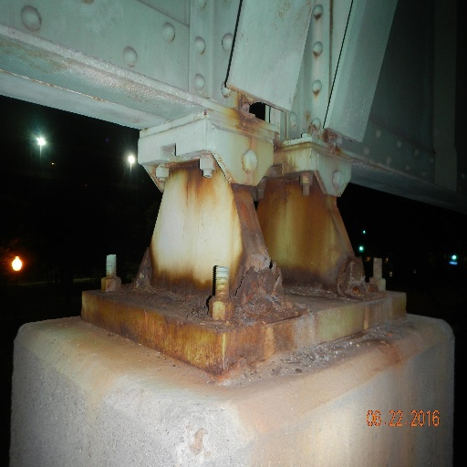
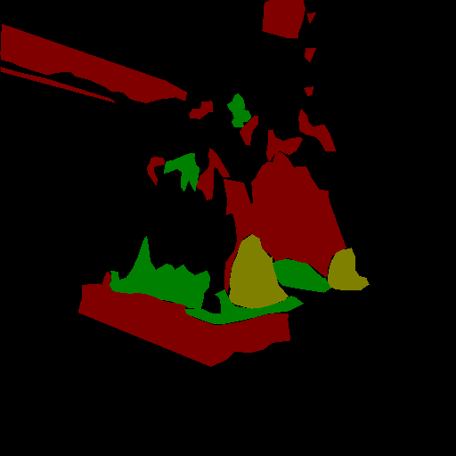

# 🧠 Corrosion Detection with Deep Learning

This repository contains the code, models, and results of my Final Degree Project (Trabajo de Fin de Grado) from the **Universidad Complutense de Madrid**, as part of the **Mathematics and Statistics** degree.

📘 **Project title**:  
*Aplicación de técnicas de aprendizaje profundo en la detección de corrosión utilizando visión por computador*  
*Application of Deep Learning Techniques for Corrosion Detection Using Computer Vision*

📄 [Download the full TFG (PDF)](TFG/CañeteMartiAlvaro_TFG.pdf)

## 🔍 Objective

The aim of this project is to develop and compare several deep learning models for image segmentation, capable of detecting corrosion from labeled images.

---

## 🗂️ Repository Structure

- `UNet++/`
  - `resnet50/`
  - `efficientnetb4/`
  - `vgg16/`

- `DeepLabV3+/`
  - `resnet50/`
  - `efficientnetb4/`

- `CustomModel/`
  - `resnet50/`
  - `efficientnetb4/`
  - `vgg16/`

- `images/` – Visual examples and comparison figures  
- `results/` – Evaluation metrics (confusion matrices, plots, etc.)
- `README.md` – Project documentation

---

## 🧪 Models Used

This project compares multiple deep learning architectures for binary segmentation of corrosion in images. The following models and backbones were used:

- **UNet++** with:
  - ResNet50
  - EfficientNetB4
  - VGG16

- **DeepLabV3+** with:
  - ResNet50
  - EfficientNetB4

- **Custom CNN-based binary classifier**, built from scratch, using:
  - ResNet50
  - EfficientNetB4
  - VGG16

---

## 📁 Dataset

The dataset used in this project is based on [corrosion_cs_classification](https://github.com/beric7/corrosion_cs_classification), which contains images of steel corrosion with corresponding segmentation masks in 3 classes.

For this project, the dataset was adapted to a **binary classification task**, where:
- `0` = Non-corroded
- `1` = Corroded (merging all original corrosion levels)

> ⚠️ The dataset is not included in this repository due to size and licensing constraints.  
> Please refer to the [original repository](https://github.com/beric7/corrosion_cs_classification) to download the data.

A sample of the transformation process is shown below:

| Original Image | Original Mask | Binary Mask (created)|
|----------------|----------------|--------------|
|  |  |  |

---

## 📊 Results

This section summarizes the performance of the models and provides visual examples of predictions.

### 🔍 Prediction Comparison – Custom Model (Backbone)

The following figure shows a visual comparison of the input image, ground truth, and predictions obtained using the custom CNN-based model (referred to as "Backbone" in the TFG):

📄 [View comparison PDF](results/comparacion_imagenes.pdf)

---

### 📋 Performance Metrics

The main evaluation metrics (Accuracy, IoU, F1-score, etc.) for the proposed models are summarized below:

📄 [Download full metrics table (PDF)](results/metricas_modelos.pdf)

---

### 🧪 Prediction Comparison Across Models

This document shows the prediction outputs for all 8 proposed models on selected test images, facilitating a side-by-side qualitative comparison:

📄 [View model comparison PDF](results/comparacion_modelos.pdf)

## ▶️ How to Run

> 🛠️ This section will be updated soon with detailed instructions on how to run the training and evaluation scripts once the code has been fully uploaded.

