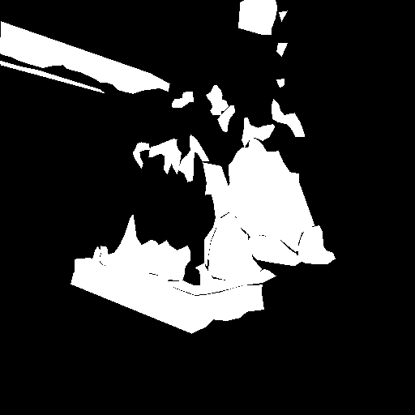

# 🧠 Corrosion Detection with Deep Learning

This repository contains the code, models, and results of my Final Degree Project (Trabajo de Fin de Grado) from the **Universidad Complutense de Madrid**, as part of the **Mathematics and Statistics** degree.

📘 **Project title**:  
*Aplicación de técnicas de aprendizaje profundo en la detección de corrosión utilizando visión por computador*  
*Application of Deep Learning Techniques for Corrosion Detection Using Computer Vision*

📄 [Download the full TFG (PDF)](TFG/CañeteMartiAlvaro_TFG.pdf)


## 🔍 Objective

The aim of this project is to develop and compare several deep learning models for image segmentation, capable of detecting corrosion from labeled images.

---

## 🗂️ Repository Structure

- `UNet++/`
  - `resnet50/`
  - `efficientnetb4/`
  - `vgg16/`

- `DeepLabV3+/`
  - `resnet50/`
  - `efficientnetb4/`

- `CustomModel/`
  - `resnet50/train_backbone_resnet50.py`
  - `efficientnetb4/train_backbone_efficientnetb4.py`
  - `vgg16/train_backbone_vgg16.py`
  - `utils/common.py` – Common helper functions used across all models


- `images/` – Visual examples and comparison figures  
- `results/` – Evaluation metrics (confusion matrices, plots, etc.)
- `README.md` – Project documentation

---

## 🧪 Models Used

This project compares multiple deep learning architectures for binary segmentation of corrosion in images. The following models and backbones were used:

- **UNet++** with:
  - ResNet50
  - EfficientNetB4
  - VGG16

- **DeepLabV3+** with:
  - ResNet50
  - EfficientNetB4

- **Custom CNN-based binary classifiers** (from scratch), each using:
  - ResNet50 → `CustomModel/resnet50/train_backbone_resnet50.py`
  - EfficientNetB4 → `CustomModel/efficientnetb4/train_backbone_efficientnetb4.py`
  - VGG16 → `CustomModel/vgg16/train_backbone_vgg16.py`


---

## 📁 Dataset

The dataset used in this project is based on [corrosion_cs_classification](https://github.com/beric7/corrosion_cs_classification), which contains images of steel corrosion with corresponding segmentation masks in 3 classes.

For this project, the dataset was adapted to a **binary classification task**, where:
- `0` = Non-corroded
- `1` = Corroded (merging all original corrosion levels)

> ⚠️ The dataset is not included in this repository due to size and licensing constraints.  
> Please refer to the [original repository](https://github.com/beric7/corrosion_cs_classification) to download the data.

A sample of the transformation process is shown below:

| Original Image | Original Mask | Binary Mask (created)|
|----------------|----------------|--------------|
|  |  |  |

---

## 📊 Results

This section summarizes the performance of the models and provides visual examples of predictions.

### 🔍 Prediction Comparison – Custom Model (Backbone)

The following figure shows a visual comparison of the input image, ground truth, and predictions obtained using the custom CNN-based model (referred to as "Backbone" in the TFG):


---

### 📋 Performance Metrics

Below are the main evaluation metrics (F1, Jaccard, Accuracy, etc.) for each model:

#### Custom Model (Backbone)

| Model            | F1     | Jaccard | Accuracy | Precision | Recall | Specificity | AUC    |
|------------------|--------|---------|----------|-----------|--------|-------------|--------|
| ResNet50         | 0.8237 | 0.7016  | 0.9291   | 0.8710    | 0.7819 | 0.9686      | 0.8711 |
| EfficientNetB4   | 0.8074 | 0.6770  | 0.9198   | 0.8151    | 0.7997 | 0.9517      | 0.8757 |
| VGG16            | 0.8116 | 0.6830  | 0.9242   | 0.8488    | 0.7784 | 0.9629      | 0.8706 |

#### DeepLabV3+

| Model            | F1     | Jaccard | Accuracy | Precision | Recall | Specificity | AUC    |
|------------------|--------|---------|----------|-----------|--------|-------------|--------|
| ResNet50         | 0.8371 | 0.7200  | 0.9338   | 0.8656    | 0.8110 | 0.9664      | 0.8887 |
| EfficientNetB4   | 0.8531 | 0.7438  | 0.9387   | 0.8597    | 0.8466 | 0.9632      | 0.9049 |

#### UNet++

| Model            | F1     | Jaccard | Accuracy | Precision | Recall | Specificity | AUC    |
|------------------|--------|---------|----------|-----------|--------|-------------|--------|
| ResNet50         | 0.8349 | 0.7166  | 0.9326   | 0.8608    | 0.8106 | 0.9651      | 0.8879 |
| EfficientNetB4   | 0.8568 | 0.7496  | 0.9402   | 0.8625    | 0.8515 | 0.9638      | 0.9077 |
| VGG16            | 0.8301 | 0.7097  | 0.9301   | 0.8494    | 0.8131 | 0.9613      | 0.8872 |

---

### 🧪 Prediction Comparison Across Models

The following figure shows the prediction outputs for all 8 proposed models on selected test images, allowing a side-by-side qualitative comparison:


## ▶️ How to Run

> 🛠️ This section will be updated soon with detailed instructions on how to run the training and evaluation scripts once the code has been fully uploaded.


Each model can be executed independently using Google Colab or locally with Python.

1. Make sure the dataset is available in your environment (Google Drive or local disk).
2. Replace the placeholder paths (marked with `# TODO`) in each script with the correct paths to your image and mask directories.
3. Run one of the model training functions, for example:

```python
from train_backbone_resnet50 import BB_ResNet50
BB_ResNet50(loss="BCE", num_epochs=10)

